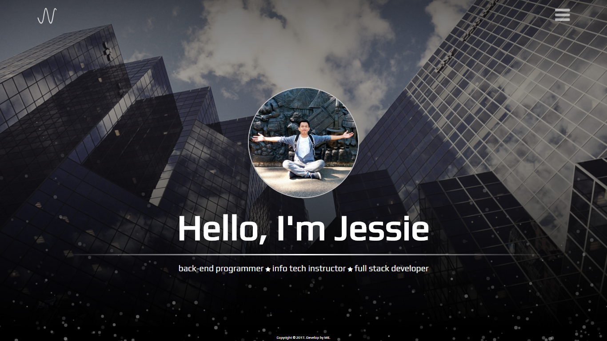
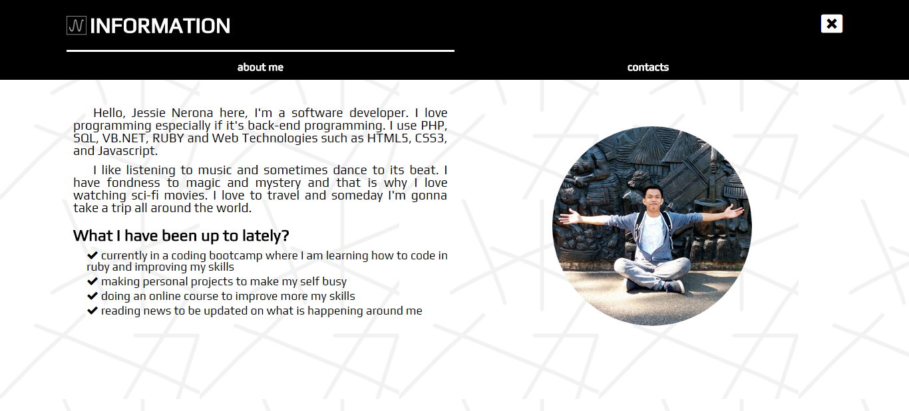
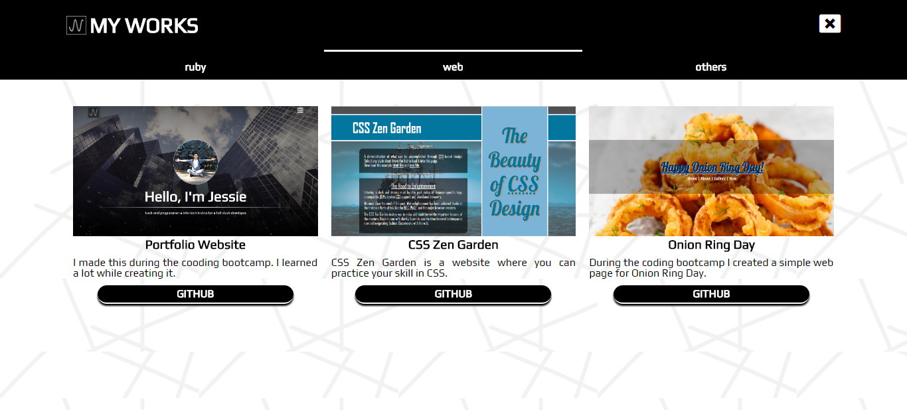

# Portfolio Website

Our final project during the first term of Vivix Coding Bootcamp is to create our own portfolio website.

## Techology Used
- HTML5
- CSS3
- Javascript/Jquery
- Font Awesome

## Features
My portfolio website is single page website and mobile first so it looks good in mobile devices. Here are some features of the website:
- In the main or index page, it has very simple animating particles creatde using javasccript.
- It contains a page about about my personal information and contacts.
- It has a page for my projects. In that page, it's divided into three tabs, my ruby projects, web dev projects and other projects.

## Screenshots

Home Page

Information Page

Works Page

